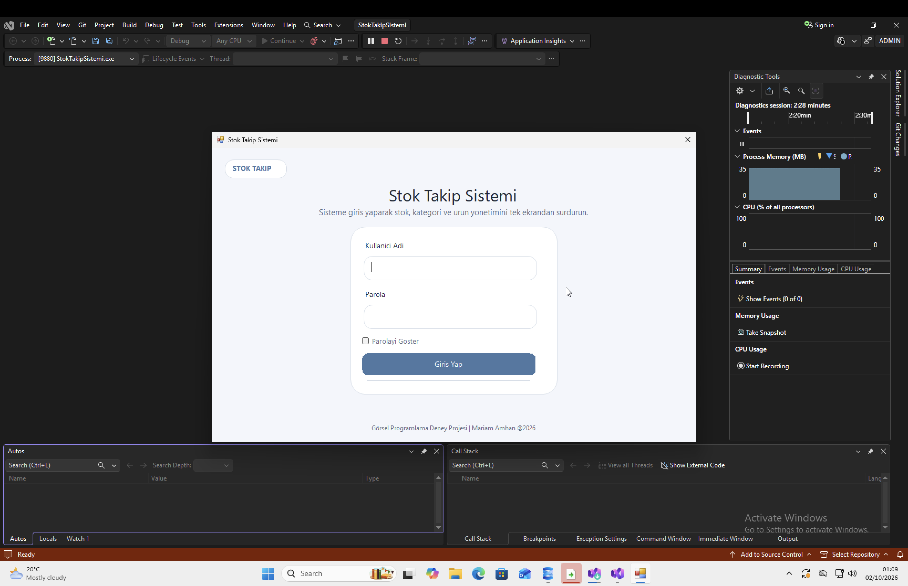
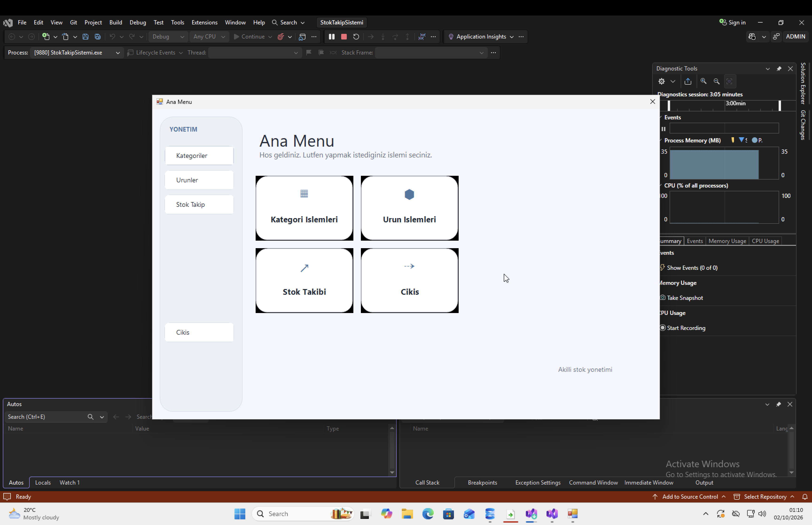
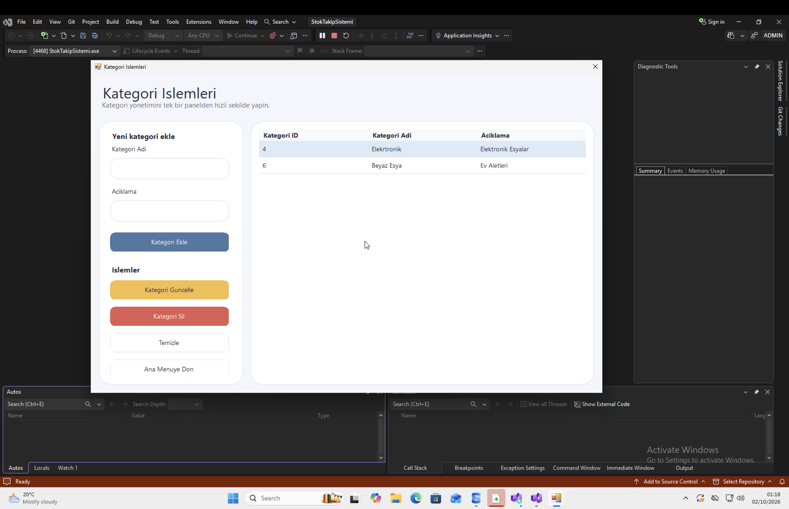
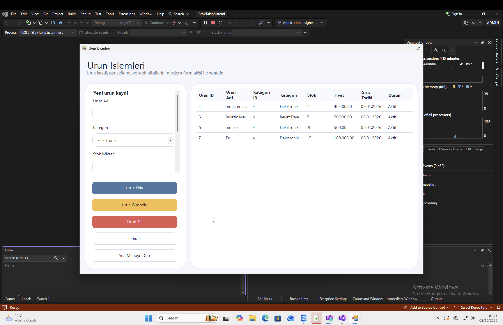
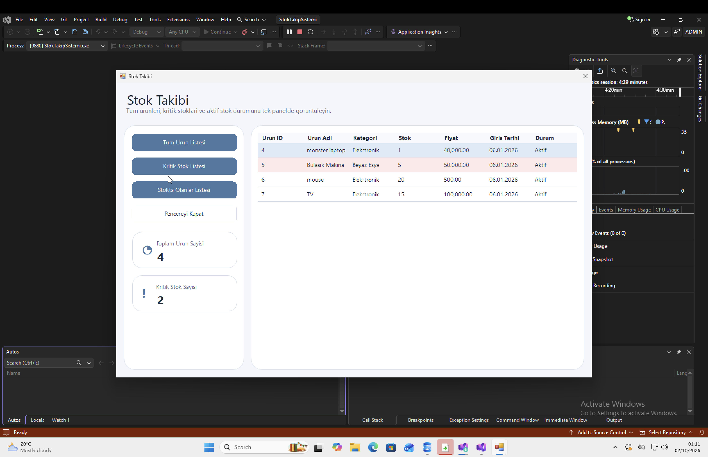

# Stock Management System

A desktop stock management application developed using C# and Windows Forms.

> **Academic Project:** Developed as part of a university course.

## Features

- User Login System
- Category Management
  - Add Category
  - Update Category
  - Delete Category
- Product Management
  - Add Product
  - Update Product
  - Delete Product
- Stock Tracking
- Critical Stock Filtering
- Data Storage using TXT Files

## Screenshots

### Login

### Main Menu

### Category Management

### Product Management

### Stock Tracking

## Technologies Used

- C#
- Windows Forms
- .NET Framework 4.7.2
- System.IO

## Project Structure

- `Data` – Handles local data storage and file operations
- `Models` – Contains application data models
- `UI` – Contains reusable user interface components
- `Forms` – Contains the main Windows Forms screens

## Future Improvements

- SQL Server Integration
- User Management
- Advanced Reporting

## How to Run

1. Clone the repository.
2. Open the solution file in Visual Studio.
3. Make sure .NET Framework 4.7.2 is installed.
4. Build and run the project.
5. The application stores its data locally using TXT files.
